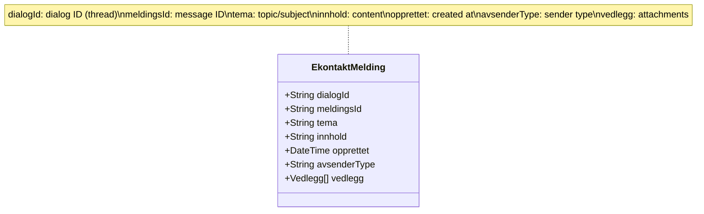
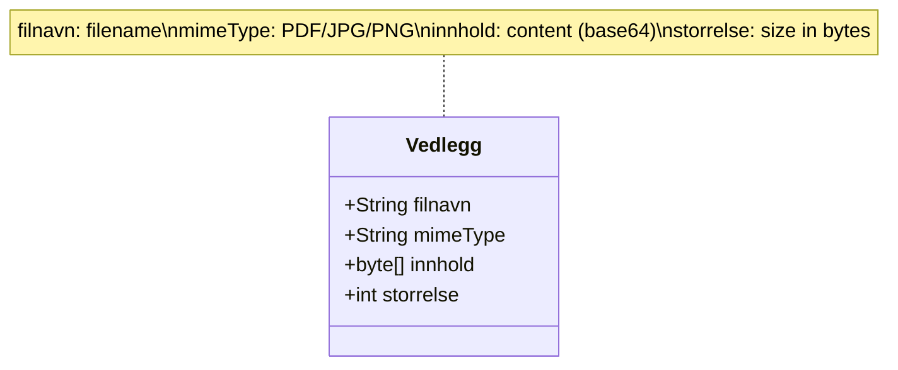
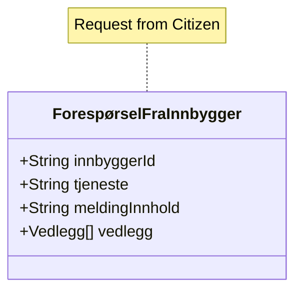
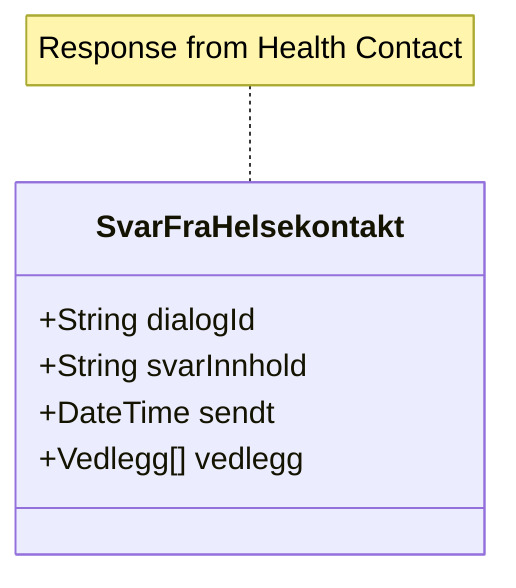
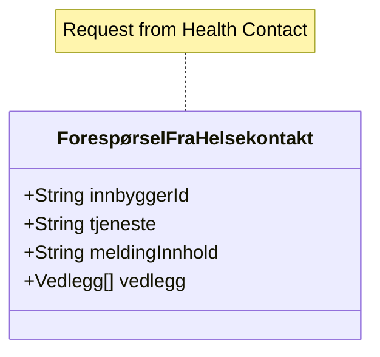
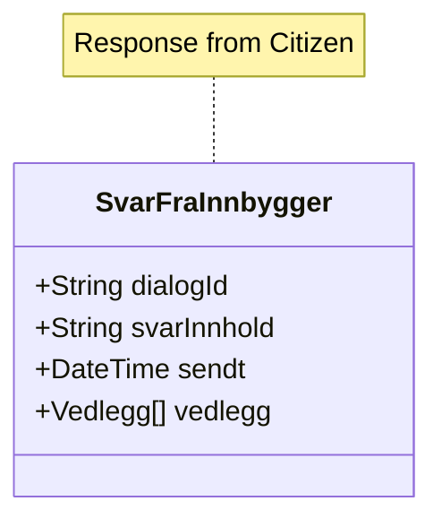

# Classes

Payload and helper models for E-kontakt AMQP messaging.

- [EkontaktMelding.mmd](EkontaktMelding.mmd) – Base message structure

- [Vedlegg.mmd](Vedlegg.mmd) – Attachment metadata/content

- [ForespørselFraInnbygger.mmd](ForespørselFraInnbygger.mmd) – Citizen-initiated request

- [SvarFraHelsekontakt.mmd](SvarFraHelsekontakt.mmd) – Provider response

- [ForespørselFraHelsekontakt.mmd](ForespørselFraHelsekontakt.mmd) – Provider-initiated request

- [SvarFraInnbygger.mmd](SvarFraInnbygger.mmd) – Citizen response

