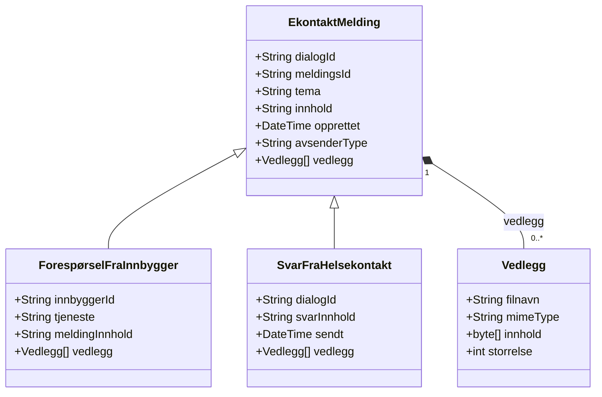
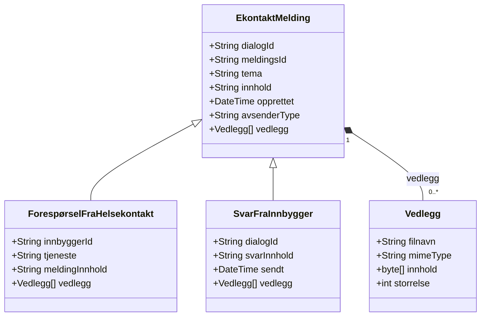

# Relations

Mermaid class relationship diagrams for E-kontakt flows.

- [CitizenInitiatedRelations.mmd](CitizenInitiatedRelations.mmd) – Citizen starts dialog

- [ProviderInitiatedRelations.mmd](ProviderInitiatedRelations.mmd) – Provider starts dialog

