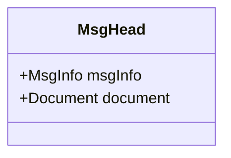
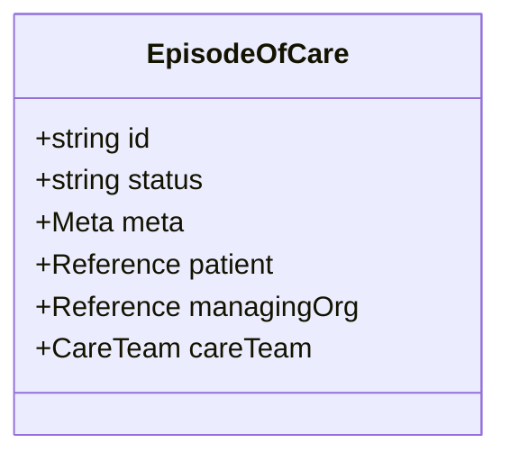
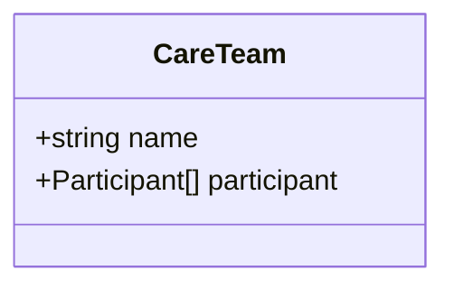
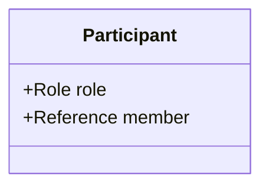
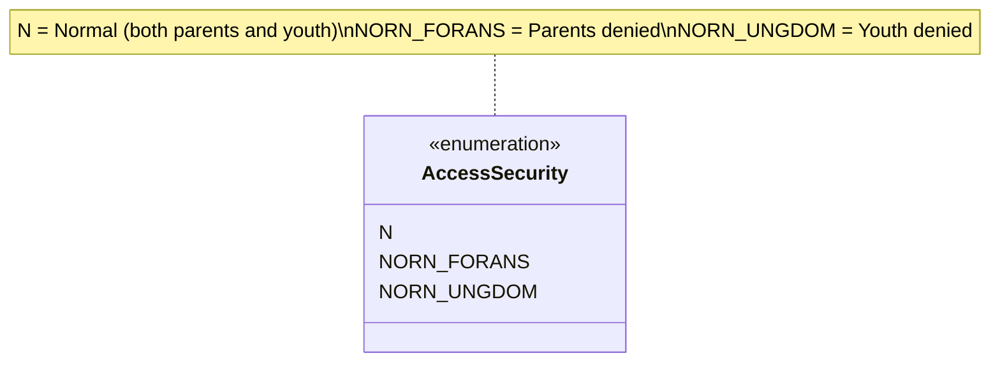

# Classes

Message header and FHIR resource snippets used in AMQP Notifikasjon Helsekontakt.

- [MsgHead.mmd](MsgHead.mmd) – Hodemelding wrapper

- [EpisodeOfCare.mmd](EpisodeOfCare.mmd) – FHIR EpisodeOfCare payload

- [CareTeam.mmd](CareTeam.mmd) – Contained CareTeam

- [Participant.mmd](Participant.mmd) – Care team participant

- [AccessSecurity.mmd](AccessSecurity.mmd) – Access restriction codes

