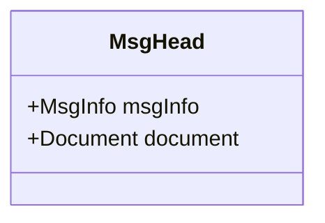
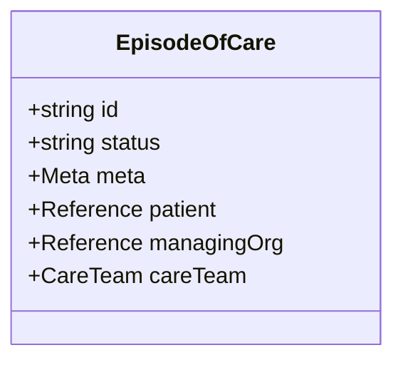
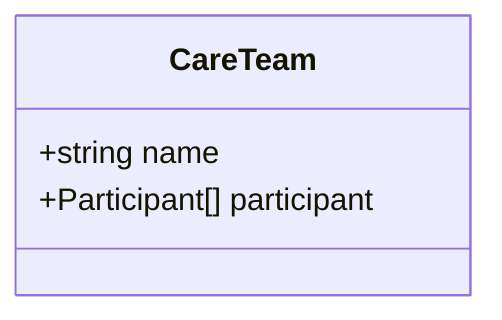
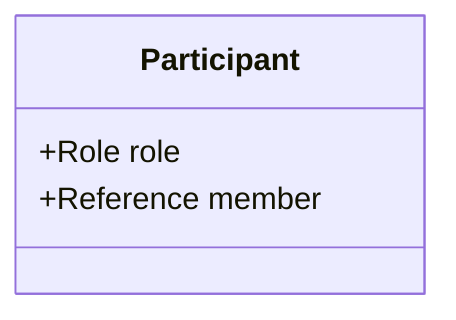
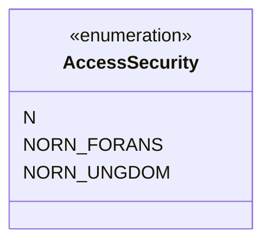

# AMQP Notifikasjon Helsekontakt

**API Name:** `NOTIFIKASJON_INNBYGGER_HELSEKONTAKT`  
**Technology:** AMQP + FHIR  
**Status:** In Production (I DRIFT)  
**Version:** v1.0 (Apr 28, 2023)  
**Use case:** General health contact notifications

## When to use

- Send new or updated health contact info to citizens.
- Enable digital dialog between citizen and provider via Helsenorge.

## Channel and authentication

- Transport: AMQP on NHN messaging infrastructure (TLS + username/password). See [AMQP Auth](../../../Authentication/AMQP_Auth/).
- Sender must be registered in Address Registry with a Level 2 HerId representing the health contact.

**Addressing and HER‑id**

- Messages use service-based addressing and rely on HER-id values. `MsgHead/MsgInfo/Sender` and `MsgHead/MsgInfo/Receiver` MUST include HER-id on two organisational levels (virksomhet and kommunikasjonspart). The HER-id used for service addresses (e.g., a health contact or endpoint) SHALL be a Level 2 HER-id from the Address Registry.

Example (sender/receiver ident snippet):

```xml
<Sender>
	<Organisation>
		<OrganisationName>UNIVERSITETSSYKEHUSET NORD-NORGE HF</OrganisationName>
		<Ident>
			<Id>9</Id>
			<TypeId V="HER" DN="HER-id" S="2.16.578.1.12.4.1.1.9051" />
		</Ident>
	</Organisation>
</Sender>
```

## Implementation note (FHIR vs MsgHead)

- This API uses **MsgHead (Hodemelding)** as a non-FHIR message header plus a **FHIR payload**.
- Use the **Firely .NET SDK** for the FHIR payload resources (e.g., `EpisodeOfCare`, `CareTeam`) and handle **MsgHead** separately (custom XML model/serialization or equivalent).

## Diagrams

- Flow: [AMQP_Notifikasjon_Flow.mmd](AMQP_Notifikasjon_Flow.mmd)
- EpisodeOfCare relations: [Relations/EpisodeOfCareRelations.mmd](Relations/EpisodeOfCareRelations.mmd)
- Classes: [Classes folder](Classes/)

Inline flow:

```mermaid
%% keep in sync with AMQP_Notifikasjon_Flow.mmd
sequenceDiagram
	participant EPJ as 🏥 Healthcare System
	participant AMQP as 📨 AMQP Broker
	participant HN as 🌐 Helsenorge

	rect rgb(240, 248, 255)
		Note over EPJ,HN: Create/Update Health Contact
		EPJ->>AMQP: Notifikasjon Helsekontakt
		Note right of EPJ: MsgHead + FHIR EpisodeOfCare
		AMQP->>HN: Forward Message
	end

	rect rgb(240, 255, 240)
		Note over HN,EPJ: Acknowledgment
		HN->>AMQP: Applikasjonskvittering
		AMQP->>EPJ: Delivery Confirmation
	end

	rect rgb(255, 250, 240)
		Note over HN,EPJ: Citizen Uses Service
		HN->>AMQP: Dialog Message
		AMQP->>EPJ: Citizen Communication
	end

```



Source file: [AMQP_Notifikasjon_Flow.mmd](AMQP_Notifikasjon_Flow.mmd)

## Message structure

Classes: [MsgHead](Classes/MsgHead.mmd), [EpisodeOfCare](Classes/EpisodeOfCare.mmd), [CareTeam](Classes/CareTeam.mmd), [Participant](Classes/Participant.mmd), [AccessSecurity](Classes/AccessSecurity.mmd).

### [MsgHead](Classes/MsgHead.mmd) (Header)

Contains sender, receiver, and patient info. The actual health contact is in the Document section as FHIR resource.

| Element         | Description             |
| --------------- | ----------------------- |
| MsgId           | Unique message ID       |
| Type            | Message type            |
| Ack             | Acknowledgment settings |
| Sender/Receiver | Organization info       |
| Patient         | Patient info            |
| Document        | FHIR EpisodeOfCare      |

Notes:

- `MsgId`: MUST be a UUID (Universally Unique Identifier) as specified in the Notifikasjon specification: https://helsenorge.atlassian.net/wiki/spaces/HELSENORGE/pages/1975418911/AMQP+Notifikasjon+Helsekontakt
- `Sender/Receiver`: MUST include HER-id on two organisational levels (virksomhet + kommunikasjonspart). Use the HER-id TypeId with OID `2.16.578.1.12.4.1.1.9051` (DN="HER-id").



### FHIR Resources

Uses two FHIR resources:

#### [EpisodeOfCare](Classes/EpisodeOfCare.mmd)

| Field                | Description                          |
| -------------------- | ------------------------------------ |
| id                   | Episode identifier                   |
| status               | Current status                       |
| meta.security        | Access restriction (for youth 12-16) |
| patient              | Reference to patient                 |
| managingOrganization | Healthcare organization              |
| careTeam             | Contained CareTeam                   |



#### [CareTeam](Classes/CareTeam.mmd) (contained)

| Field       | Description                        |
| ----------- | ---------------------------------- |
| name        | Team/service name                  |
| participant | List of healthcare personnel/roles |



#### [Participant](Classes/Participant.mmd)

| Field    | Description                    |
| -------- | ------------------------------ |
| `role`   | Role of the care team member   |
| `member` | Reference to practitioner/role |



### [AccessSecurity](Classes/AccessSecurity.mmd) Enum (meta.security)

`meta.security` indicates access restriction and is _conditional_.

- Recommended for patients under 16 (0–16).
- Required when the patient is 12–15 to document that an explicit access assessment has been made.
- Note: enforcement is not implemented on Helsenorge as of Nov 13, 2025 (per Atlassian).

| Code        | Norwegian                 | English                            |
| ----------- | ------------------------- | ---------------------------------- |
| N           | Normal                    | Both parents and youth have access |
| NORN_FORANS | Nektet, foreldreansvarlig | Parents denied (youth only)        |
| NORN_UNGDOM | Nektet, ungdom            | Youth denied (parents only)        |



_Source: Volven kodeverk 9603_

## Dialog Categorization (New Feature - Nov 2025)

Health contacts can now specify dialog categories:

- Helps EPJ route incoming messages to correct personnel
- Citizen sees category options when sending messages
- If no categories defined, feature is hidden from citizen

Implemented via CareTeam participants with different roles.

## [Flow](AMQP_Notifikasjon_Flow.mmd)

1. **Healthcare System** sends notification via AMQP
2. Message contains `MsgHead` + FHIR `EpisodeOfCare`
3. **Helsenorge** processes and returns acknowledgment
4. Citizen can now use digital services (dialog, appointments)
5. If the health contact offers Digital Dialog, citizen messages flow back via AMQP Dialog

## Standards

- Hodemelding v1.2
- FHIR EpisodeOfCare (base): https://hl7.org/fhir/episodeofcare.html
- FHIR CareTeam (base): https://hl7.org/fhir/careteam.html

## Sources

- AMQP Notifikasjon Helsekontakt: https://helsenorge.atlassian.net/wiki/spaces/HELSENORGE/pages/1975418911/AMQP+Notifikasjon+Helsekontakt
- AMQP Dialog helsepersonell (required if offering Digital Dialog): https://helsenorge.atlassian.net/wiki/spaces/HELSENORGE/pages/1348175352
- API-katalog (status/version): https://helsenorge.atlassian.net/wiki/spaces/HELSENORGE/pages/1348174674/API-katalog
- Meldingsutveksling med Helsenorge: https://helsenorge.atlassian.net/wiki/spaces/HELSENORGE/pages/690913297/Meldingsutveksling+med+Helsenorge
