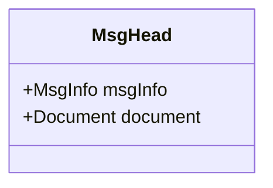
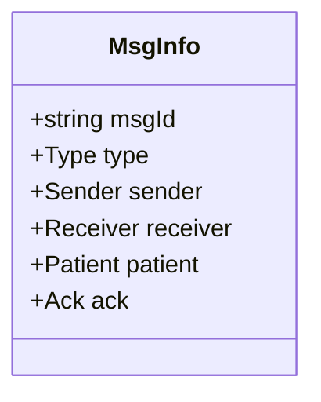
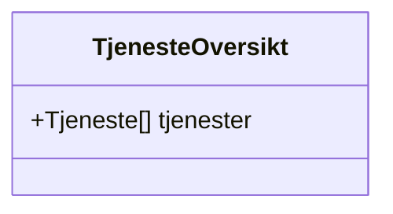
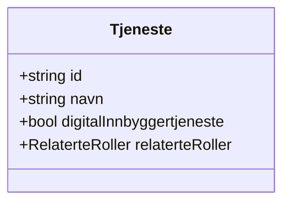
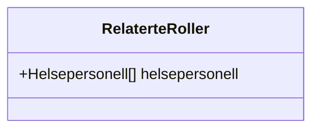
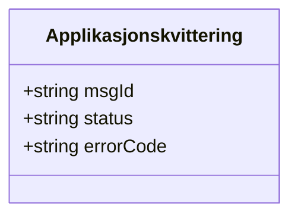

# Classes

Message header and payload models for AMQP Tjenesteoversikt.

- [MsgHead.mmd](MsgHead.mmd) – Hodemelding wrapper

- [MsgInfo.mmd](MsgInfo.mmd) – Header metadata

- [TjenesteOversikt.mmd](TjenesteOversikt.mmd) – Service overview container

- [Tjeneste.mmd](Tjeneste.mmd) – Individual service entry

- [RelaterteRoller.mmd](RelaterteRoller.mmd) – Related personnel roles

- [Applikasjonskvittering.mmd](Applikasjonskvittering.mmd) – Application receipt

