# AMQP Tjenesteoversikt

Sends an overview of home care services to citizens via AMQP messaging.

**API Name:** `DIALOG_INNBYGGER_TJENESTEOVERSIKT`  
**Technology:** AMQP  
**Status:** In Production (I DRIFT)  
**Version:** v1.0 (Feb 3, 2017)  
**Use case:** Home care services (hjemmetjenester) only

## When to use

- Citizen receives home care services and should see them in Helsenorge.
- Services are marked as digital citizen services and must be synchronized.

## Channel and authentication

- Transport: AMQP on NHN messaging infrastructure (cert-based setup).
- Queue/routing per NHN configuration for this API.

## Diagrams

- Flow: [AMQP_Tjenesteoversikt_Flow.mmd](AMQP_Tjenesteoversikt_Flow.mmd)
- MsgHead relations: [Relations/MsgHeadRelations.mmd](Relations/MsgHeadRelations.mmd)
- Applikasjonskvittering: [Relations/ApplikasjonskvitteringRelations.mmd](Relations/ApplikasjonskvitteringRelations.mmd)
- Classes: [Classes folder](Classes/)

Inline flow:

```mermaid
%% keep in sync with AMQP_Tjenesteoversikt_Flow.mmd
sequenceDiagram
	participant Sender as 🏥 Healthcare Provider
	participant AMQP as 📨 AMQP Broker
	participant HN as 🌐 Helsenorge

	rect rgb(240, 248, 255)
		Note over Sender,HN: Send TjenesteOversikt
		Sender->>AMQP: TjenesteOversikt Message
		Note right of Sender: MsgHead + TjenesteOversikt
		AMQP->>HN: Forward Message
	end

	rect rgb(240, 255, 240)
		Note over HN,Sender: Acknowledgment
		HN->>AMQP: Applikasjonskvittering
		AMQP->>Sender: Delivery Confirmation
	end

```

Source file: [AMQP_Tjenesteoversikt_Flow.mmd](AMQP_Tjenesteoversikt_Flow.mmd)

## Message structure

Classes: [MsgHead](Classes/MsgHead.mmd), [MsgInfo](Classes/MsgInfo.mmd), [TjenesteOversikt](Classes/TjenesteOversikt.mmd), [Tjeneste](Classes/Tjeneste.mmd), [RelaterteRoller](Classes/RelaterteRoller.mmd), [Applikasjonskvittering](Classes/Applikasjonskvittering.mmd).

### [MsgHead](Classes/MsgHead.mmd) (Header Message)

`MsgHead` is the Hodemelding wrapper and contains `msgInfo` (header metadata) and the message `document` (payload).

### [MsgInfo](Classes/MsgInfo.mmd)

| Field      | Norwegian   | English             |
| ---------- | ----------- | ------------------- |
| `msgId`    | Meldings-ID | Message ID (unique) |
| `type`     | Type        | Message type        |
| `sender`   | Avsender    | Sender info         |
| `receiver` | Mottaker    | Receiver info       |
| `patient`  | Pasient     | Patient info        |
| `ack`      | Kvittering  | Acknowledgment rule |

### [TjenesteOversikt](Classes/TjenesteOversikt.mmd) (Service Overview)

| Field       | Norwegian | English          |
| ----------- | --------- | ---------------- |
| `tjenester` | Tjenester | List of services |

### [Tjeneste](Classes/Tjeneste.mmd) (Service)

| Field                      | Norwegian                 | English                           |
| -------------------------- | ------------------------- | --------------------------------- |
| `id`                       | ID                        | Service identifier                |
| `navn`                     | Navn                      | Service name                      |
| `digitalInnbyggertjeneste` | Digital innbyggertjeneste | Is digital citizen service (bool) |
| `relaterteRoller`          | Relaterte roller          | Related roles/personnel           |

### [RelaterteRoller](Classes/RelaterteRoller.mmd) (Related Roles)

| Field            | Norwegian      | English                   |
| ---------------- | -------------- | ------------------------- |
| `helsepersonell` | Helsepersonell | Healthcare personnel list |

### [Applikasjonskvittering](Classes/Applikasjonskvittering.mmd) (Application Receipt)

| Field       | Norwegian   | English                |
| ----------- | ----------- | ---------------------- |
| `msgId`     | Meldings-ID | Original message ID    |
| `status`    | Status      | Processing status      |
| `errorCode` | Feilkode    | Error code (if failed) |

## [Flow](AMQP_Tjenesteoversikt_Flow.mmd) (summary)

1. Provider sends `TjenesteOversikt` (MsgHead + payload) via AMQP.
2. Helsenorge processes and returns `Applikasjonskvittering`.
3. If processing fails, the receipt indicates failure (status/errorCode).

## Standards

- Hodemelding v1.2: https://www.ehelse.no/standardisering/standarder/standard-for-hodemelding
- Applikasjonskvittering: https://www.ehelse.no/standardisering/standarder/standard-for-applikasjonskvittering

## Sources

- API-katalog (status/version): https://helsenorge.atlassian.net/wiki/spaces/HELSENORGE/pages/1348174674/API-katalog
- Helsenorge for kommuner – hjemmetjenesten: https://helsenorge.atlassian.net/wiki/spaces/HELSENORGE/pages/1875804167/Helsenorge+for+kommuner+-+hjemmetjenesten
- Meldingsutveksling med Helsenorge: https://helsenorge.atlassian.net/wiki/spaces/HELSENORGE/pages/690913297/Meldingsutveksling+med+Helsenorge
