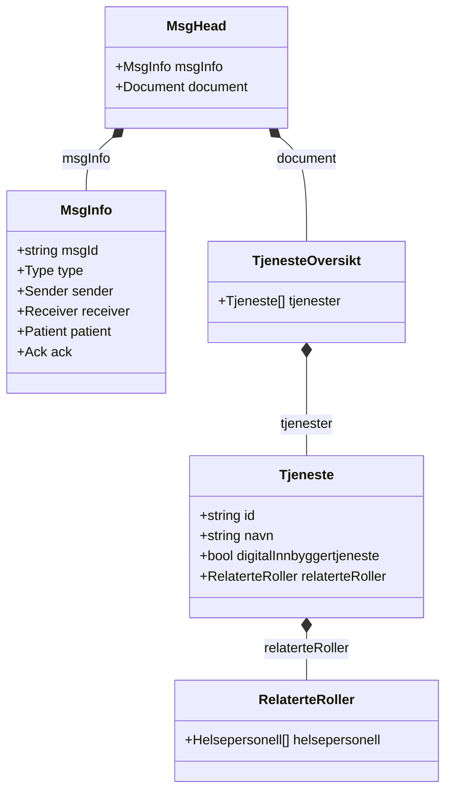
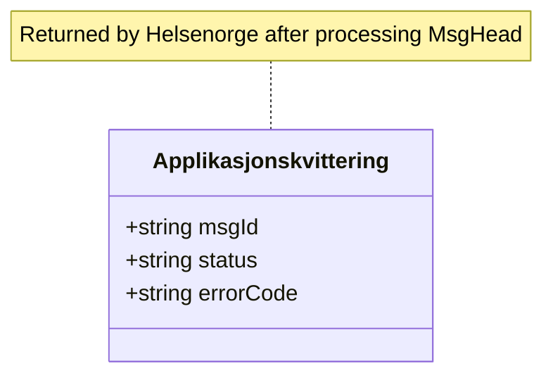

# Relations

Mermaid diagrams showing message and payload relationships for AMQP Tjenesteoversikt.

- [MsgHeadRelations.mmd](MsgHeadRelations.mmd) – Hodemelding linkages

- [ApplikasjonskvitteringRelations.mmd](ApplikasjonskvitteringRelations.mmd) – Receipt structure

