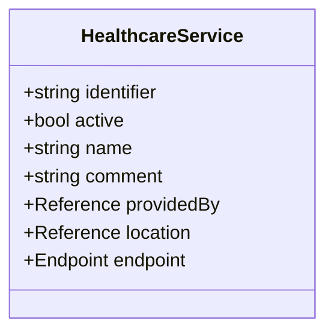
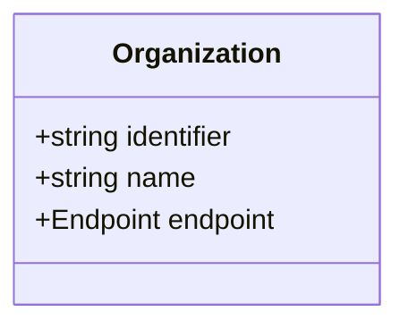
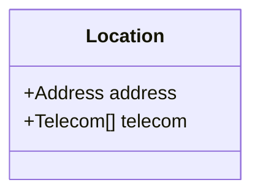
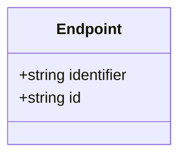
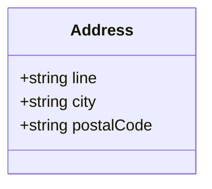
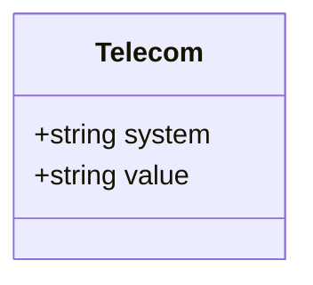
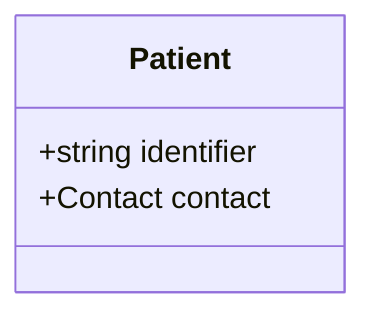
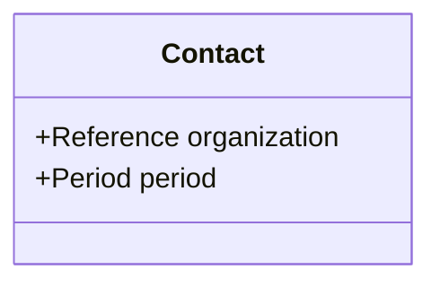
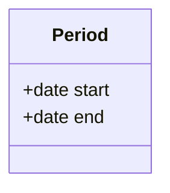

# Classes

FHIR resource snippets for Medlemstjenester (health offerings and member lists).

- [HealthcareService.mmd](HealthcareService.mmd) – Offered service

- [Organization.mmd](Organization.mmd) – Providing organization

- [Location.mmd](Location.mmd) – Service location

- [Endpoint.mmd](Endpoint.mmd) – Communication endpoint

- [Address.mmd](Address.mmd) – Postal address

- [Telecom.mmd](Telecom.mmd) – Contact points

- [Patient.mmd](Patient.mmd) – Member record

- [Contact.mmd](Contact.mmd) – Member contact linkage

- [Period.mmd](Period.mmd) – Service period

