# Medlemstjenester (Membership Services)

**Technology:** REST + FHIR (R4)  
**Endpoint:** `https://eksternapi.helsenorge.no/helsekontakter/api/v1`  
**Auth:** JWT Bearer token (`Authorization: Bearer <token>`)  
**Scope:** Helsekontakter

## When to use

- You offer the same services to all members and need them visible in Helsenorge.
- You must register member lists so citizens can use digital services (dialog, appointments).

## Authentication

The endpoint is protected by a JWT bearer token (see Swagger `JWT` security scheme). In practice this is typically obtained via HelseID with scope `Helsekontakter`.

See also:

- [HelseID authentication (shared)](../../../Authentication/HelseID_Auth/README.md)
- [HelseID auth flow](../../../Authentication/HelseID_Auth/HelseID_Auth_Flow.mmd)

## Process (inline view)

```mermaid
%% keep in sync with Medlemstjenester_Flow.mmd
sequenceDiagram
	participant MS as 🏢 Membership System
	participant Auth as 🔐 HelseID
	participant HN as 🌐 Helsenorge API

	rect rgb(240, 248, 255)
		Note over MS,Auth: Authentication
		MS->>Auth: Request Access Token
		Auth-->>MS: Access Token (scope: Helsekontakter)
	end

	rect rgb(255, 250, 240)
		Note over MS,HN: 1. Send Health Offerings
		MS->>HN: POST /helsekontakter/api/v1
		Note right of MS: FHIR Bundle: HealthcareService + Organization + Location
		HN-->>MS: 200 OK
	end

	rect rgb(240, 255, 240)
		Note over MS,HN: 2. Send Member List
		MS->>HN: POST /helsekontakter/api/v1
		Note right of MS: FHIR Bundle: Patient[]
		HN-->>MS: Response per member
	end

```

Source file: [Medlemstjenester_Flow.mmd](Medlemstjenester_Flow.mmd)

### Steps (summary)

### 1) Send health offerings (Helsetilbud)

Defines what services members receive.

Core classes: [HealthcareService](Classes/HealthcareService.mmd), [Organization](Classes/Organization.mmd), [Location](Classes/Location.mmd), [Endpoint](Classes/Endpoint.mmd), [Address](Classes/Address.mmd), [Telecom](Classes/Telecom.mmd).

| Resource                                               | Field               | Description                     | Required |
| ------------------------------------------------------ | ------------------- | ------------------------------- | -------- |
| **[HealthcareService](Classes/HealthcareService.mmd)** | identifier          | Local GUID                      | ✅       |
|                                                        | active              | Is active                       |          |
|                                                        | name                | Service name (shown to citizen) | ✅       |
|                                                        | comment             | Description                     |          |
|                                                        | providedBy          | Ref to Organization             | ✅       |
|                                                        | endpoint.identifier | Communication partner ID        | ✅       |
| **[Organization](Classes/Organization.mmd)**           | identifier          | Org number (e.g., 948 554 062)  | ✅       |
|                                                        | name                | Organization name               | ✅       |
|                                                        | endpoint.id         | Business ID                     | ✅       |
| **[Location](Classes/Location.mmd)**                   | address.line        | Street address                  | ✅       |
|                                                        | address.city        | City                            | ✅       |
|                                                        | address.postalCode  | Postal code                     | ✅       |
|                                                        | telecom.value       | Phone/URL                       |          |

#### [HealthcareService](Classes/HealthcareService.mmd)

| Field        | Description                     |
| ------------ | ------------------------------- |
| `identifier` | Local GUID                      |
| `active`     | Is active                       |
| `name`       | Service name (shown to citizen) |
| `comment`    | Description                     |
| `providedBy` | Reference to `Organization`     |
| `location`   | Reference to `Location`         |
| `endpoint`   | Endpoint identifier/id          |

#### [Organization](Classes/Organization.mmd)

| Field        | Description                                |
| ------------ | ------------------------------------------ |
| `identifier` | Organization number (e.g., 948 554 062)    |
| `name`       | Organization name                          |
| `endpoint`   | Endpoint with business ID/communication ID |

#### [Location](Classes/Location.mmd)

| Field     | Description    |
| --------- | -------------- |
| `address` | Street address |
| `telecom` | Contact points |

#### [Endpoint](Classes/Endpoint.mmd)

| Field        | Description              |
| ------------ | ------------------------ |
| `identifier` | Communication partner ID |
| `id`         | Business ID              |

#### [Address](Classes/Address.mmd)

| Field        | Description |
| ------------ | ----------- |
| `line`       | Street line |
| `city`       | City        |
| `postalCode` | Postal code |

#### [Telecom](Classes/Telecom.mmd)

| Field    | Description      |
| -------- | ---------------- |
| `system` | Phone/URL system |
| `value`  | Phone/URL value  |

### 2) Send member list (Medlemsliste)

Links members to offerings.

Classes: [Patient](Classes/Patient.mmd), [Contact](Classes/Contact.mmd), [Period](Classes/Period.mmd).

| Field ([Patient](Classes/Patient.mmd)) | Description                          | Required |
| -------------------------------------- | ------------------------------------ | -------- |
| identifier                             | National ID (fødselsnummer/d-nummer) | ✅       |
| contact.organization.identifier        | Organization number                  | ✅       |
| contact.period.start                   | Service start date                   | ✅       |
| contact.period.end                     | Service end date                     | ✅       |

#### [Patient](Classes/Patient.mmd)

| Field        | Description                                   |
| ------------ | --------------------------------------------- |
| `identifier` | National ID (fødselsnummer/d-nummer)          |
| `contact`    | Contact record linking to organization/period |

#### [Contact](Classes/Contact.mmd)

| Field          | Description                   |
| -------------- | ----------------------------- |
| `organization` | Reference to `Organization`   |
| `period`       | Active period for the service |

#### [Period](Classes/Period.mmd)

| Field   | Description   |
| ------- | ------------- |
| `start` | Service start |
| `end`   | Service end   |

## Diagrams

- Flow: [Medlemstjenester_Flow.mmd](Medlemstjenester_Flow.mmd)
- HealthcareService relations: [Relations/HealthcareServiceRelations.mmd](Relations/HealthcareServiceRelations.mmd)
- Patient relations: [Relations/PatientRelations.mmd](Relations/PatientRelations.mmd)
- Classes: [Classes folder](Classes/)

## Non-functional requirements

| Type                      | Requirement                          |
| ------------------------- | ------------------------------------ |
| Response time (offerings) | < 3 sec for 99%                      |
| Response time (members)   | < 10 sec for 99%                     |
| Timeout (members)         | 15 sec                               |
| Retry                     | Must handle resending if no response |

## Environments

| Environment | URL                                                              |
| ----------- | ---------------------------------------------------------------- |
| MAS-01      | https://eksternapi-hn-mas-01.int-hn.nhn.no/helsekontakter/api/v1 |
| MAS-02      | https://eksternapi-hn-mas-02.int-hn.nhn.no/helsekontakter/api/v1 |
| TEST1       | https://eksternapi.hn.test.nhn.no/helsekontakter/api/v1          |
| TEST2       | https://eksternapi.hn2.test.nhn.no/helsekontakter/api/v1         |
| PROD        | https://eksternapi.helsenorge.no/helsekontakter/api/v1           |

## References / Sources

- Medlemstjenester (official): https://helsenorge.atlassian.net/wiki/spaces/HELSENORGE/pages/24018962/Medlemstjenester
- Helsekontakter Swagger (prod): https://eksternapi.helsenorge.no/helsekontakter/swagger/index.html
- Helsekontakter OpenAPI (prod): https://eksternapi.helsenorge.no/helsekontakter/swagger/v1/swagger.json
- Helsekontakter Swagger (test): https://eksternapi.hn.test.nhn.no/helsekontakter/swagger/index.html
- Helsekontakter OpenAPI (test): https://eksternapi.hn.test.nhn.no/helsekontakter/swagger/v1/swagger.json

## Notes

- If citizen hasn't consented to Helsenorge, their info cannot be stored.
- Track digital status and periodically retry inactive members.
- Split member lists into batches to avoid timeouts.
