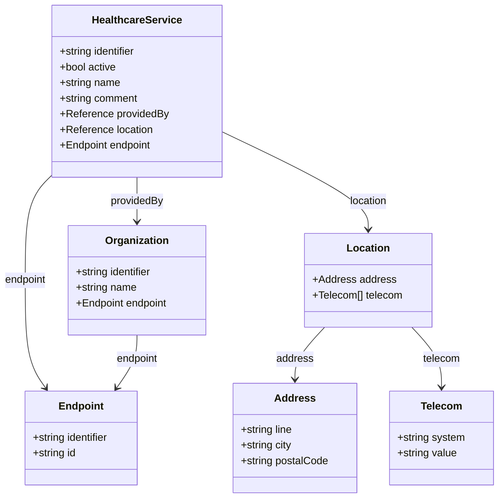
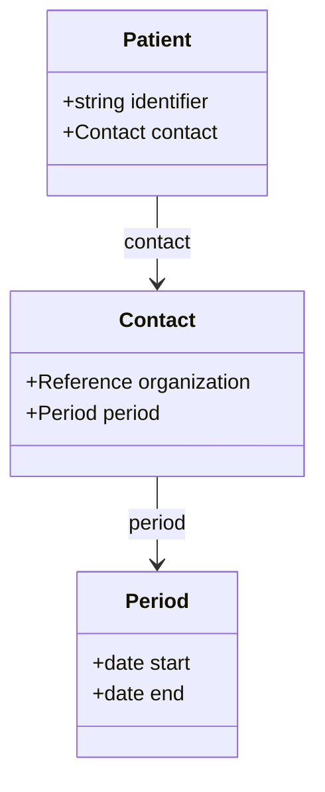

# Relations

Mermaid diagrams of resource relationships for Medlemstjenester.

- [HealthcareServiceRelations.mmd](HealthcareServiceRelations.mmd) – Offered services and endpoints

- [PatientRelations.mmd](PatientRelations.mmd) – Member-to-organization linkage

