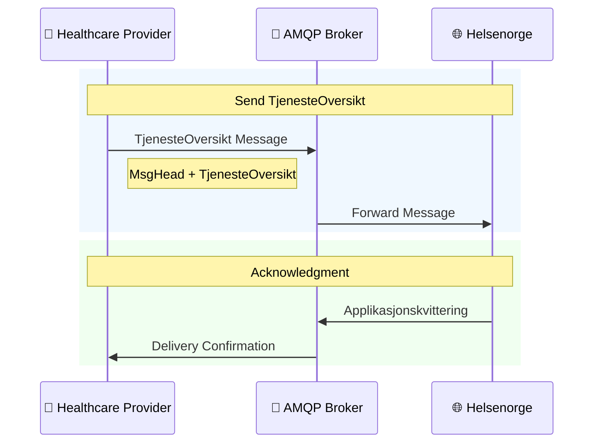
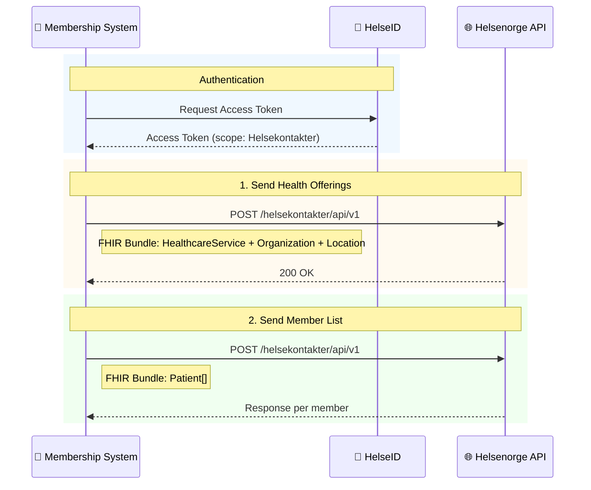
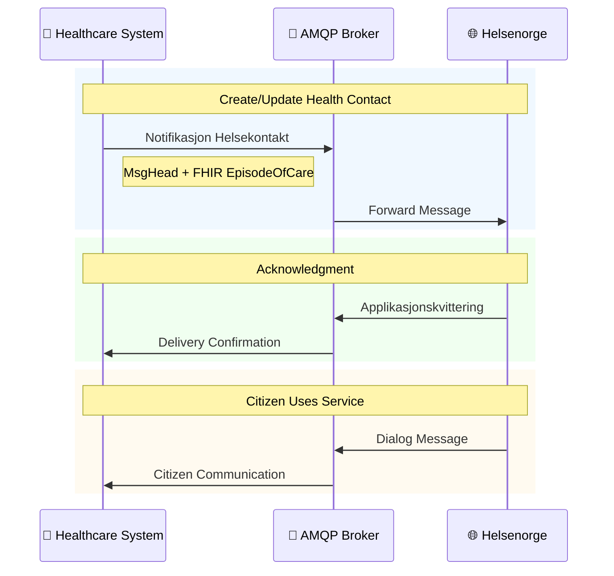

# Helsekontakt (Health Contact)

Citizen entry point for digital communication and services via Helsenorge.

## When to use

- You need to expose digital dialog or service access for citizens.
- You manage health contacts across primary care, specialists, or membership services.
- You must notify citizens about available digital services or allow messaging.

## Variants and technology

| Technology  | API                                                              | Use Case                | Status                    |
| ----------- | ---------------------------------------------------------------- | ----------------------- | ------------------------- |
| AMQP        | [Tjenesteoversikt](AMQP%20Tjenesteoversikt/)                     | Home care services only | ⚠️ **DEPRECATED**         |
| REST + FHIR | [Medlemstjenester](Medlemstjenester/)                            | Membership services     | In Production             |
| AMQP + FHIR | [Notifikasjon Helsekontakt](AMQP%20Notifikasjon%20Helsekontakt/) | General notifications   | In Production (Use this!) |

> **⚠️ Note:** AMQP Tjenesteoversikt is deprecated and should NOT be used by new actors. Use [AMQP Notifikasjon Helsekontakt](AMQP%20Notifikasjon%20Helsekontakt/) instead for creating health contacts.

## Health contact types

1. **Fastlege** - General Practitioner (from FLO registry)
2. **Hjemmetjenester** - Home care services
3. **Øvrig primærhelsetjeneste** - Other primary care
4. **Spesialisthelsetjeneste** - Specialist care
5. **Medlemstjenester** - Membership services

## Diagrams (clickable + inline)

### Tjenesteoversikt ⚠️ DEPRECATED

> **⚠️ This API is deprecated.** Use [Notifikasjon Helsekontakt](#notifikasjon-helsekontakt) for new implementations.

Inline view:

Source: [Flow](AMQP%20Tjenesteoversikt/AMQP_Tjenesteoversikt_Flow.mmd), [MsgHead](AMQP%20Tjenesteoversikt/Relations/MsgHeadRelations.mmd), [Applikasjonskvittering](AMQP%20Tjenesteoversikt/Relations/ApplikasjonskvitteringRelations.mmd)

### Medlemstjenester

Inline view:

Source: [Flow](Medlemstjenester/Medlemstjenester_Flow.mmd), [HealthcareService](Medlemstjenester/Relations/HealthcareServiceRelations.mmd), [Patient](Medlemstjenester/Relations/PatientRelations.mmd)

### Notifikasjon Helsekontakt

Inline view:

Source: [Flow](AMQP%20Notifikasjon%20Helsekontakt/AMQP_Notifikasjon_Flow.mmd), [EpisodeOfCare](AMQP%20Notifikasjon%20Helsekontakt/Relations/EpisodeOfCareRelations.mmd)

## Quick comparison

| Feature    | Tjenesteoversikt (⚠️ Deprecated) | Medlemstjenester | Notifikasjon (✅ Recommended) |
| ---------- | -------------------------------- | ---------------- | ----------------------------- |
| Technology | AMQP                             | REST/FHIR        | AMQP + FHIR                   |
| Use case   | Home care (legacy)               | Group services   | General                       |
| Auth       | AMQP (TLS + user/pass)           | HelseID (Bearer) | AMQP (TLS + user/pass)        |
| Payload    | XML (MsgHead)                    | FHIR Bundle      | MsgHead + FHIR                |

> **⚠️ Note:** Tjenesteoversikt is deprecated. New implementations should use Notifikasjon Helsekontakt.

## References / Sources

- API catalog (process names + status): https://helsenorge.atlassian.net/wiki/spaces/HELSENORGE/pages/1348174674/API-katalog
- AMQP Notifikasjon Helsekontakt: https://helsenorge.atlassian.net/wiki/spaces/HELSENORGE/pages/1975418911/AMQP+Notifikasjon+Helsekontakt
- Helsenorge for kommuner – hjemmetjenesten: https://helsenorge.atlassian.net/wiki/spaces/HELSENORGE/pages/1875804167/Helsenorge+for+kommuner+-+hjemmetjenesten
- Helsekontakter Swagger (test): https://eksternapi.hn.test.nhn.no/helsekontakter/swagger/index.html
- Helsekontakter Swagger (prod): https://eksternapi.helsenorge.no/helsekontakter/swagger/index.html
- Meldingsutveksling med Helsenorge (AMQP prerequisites): https://helsenorge.atlassian.net/wiki/spaces/HELSENORGE/pages/690913297/Meldingsutveksling+med+Helsenorge
- Test environments and API endpoint patterns: https://helsenorge.atlassian.net/wiki/spaces/HELSENORGE/pages/1552384092/Testmilj+er+og+endepunkter
