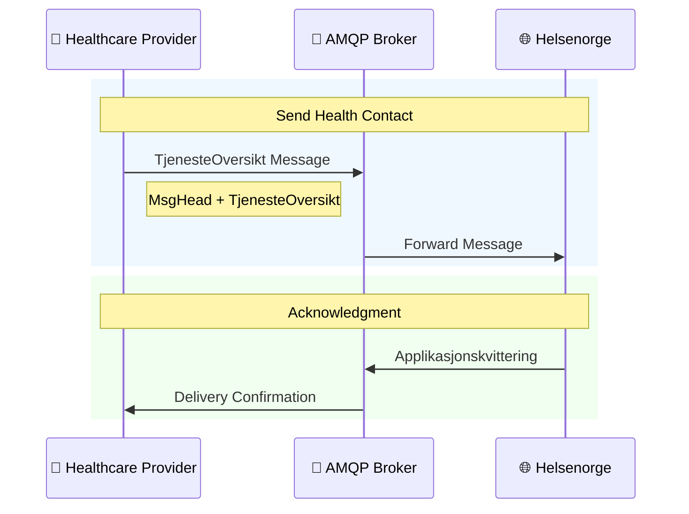
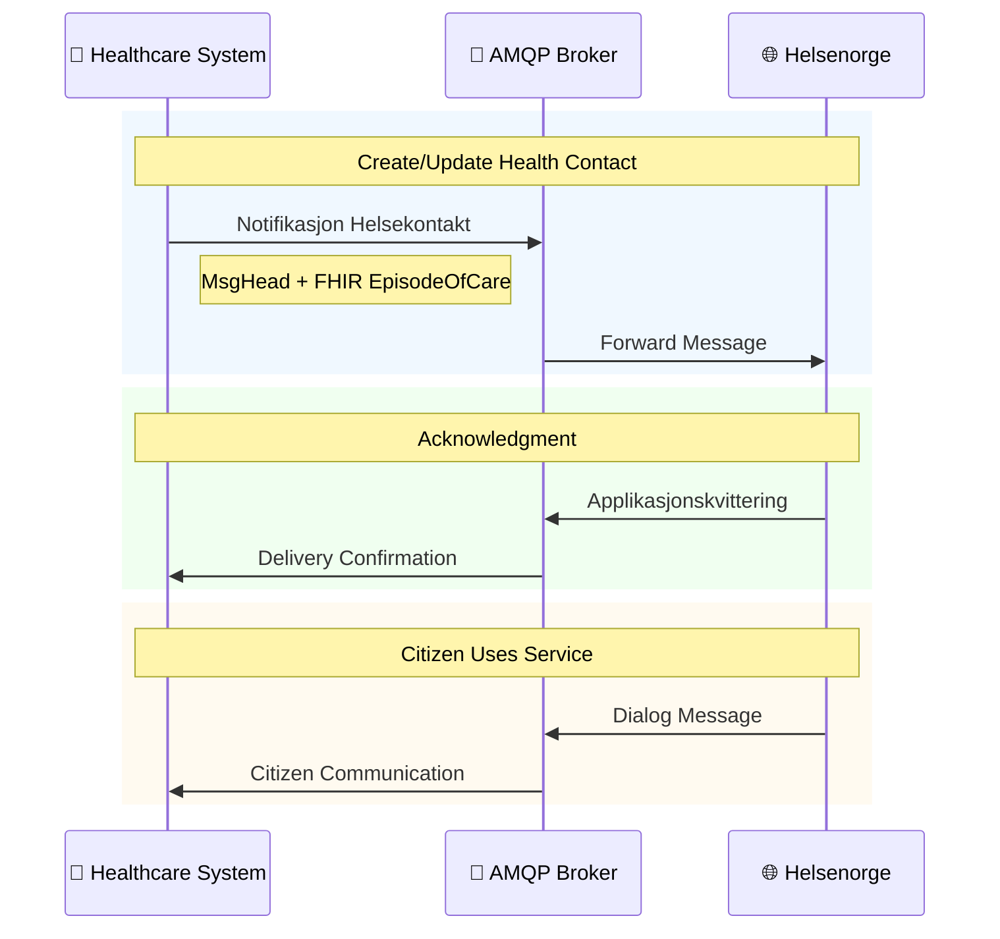

# Helsekontakt (Health Contact)

Citizen entry point for digital communication and services via Helsenorge.

## When to use

- You need to expose digital dialog or service access for citizens.
- You manage health contacts across primary care, specialists, or membership services.
- You must notify citizens about available digital services or allow messaging.

## Variants and technology

| Technology  | API                                                              | Use Case                | Status                |
| ----------- | ---------------------------------------------------------------- | ----------------------- | --------------------- |
| AMQP        | [Tjenesteoversikt](AMQP%20Tjenesteoversikt/)                     | Home care services only | In Production         |
| FHIR        | [Medlemstjenester](Medlemstjenester/)                            | Membership services     | In Production         |
| AMQP + FHIR | [Notifikasjon Helsekontakt](AMQP%20Notifikasjon%20Helsekontakt/) | General notifications   | In Production (Pilot) |

## Health contact types

1. **Fastlege** - General Practitioner (from FLO registry)
2. **Hjemmetjenester** - Home care services
3. **Øvrig primærhelsetjeneste** - Other primary care
4. **Spesialisthelsetjeneste** - Specialist care
5. **Medlemstjenester** - Membership services

## Diagrams (clickable + inline)

### Tjenesteoversikt

Inline view:

Source: [Flow](AMQP%20Tjenesteoversikt/AMQP_Tjenesteoversikt_Flow.mmd), [MsgHead](AMQP%20Tjenesteoversikt/Relations/MsgHeadRelations.mmd), [Applikasjonskvittering](AMQP%20Tjenesteoversikt/Relations/ApplikasjonskvitteringRelations.mmd)

### Medlemstjenester

Inline view:

Source: [Flow](Medlemstjenester/Medlemstjenester_Flow.mmd), [HealthcareService](Medlemstjenester/Relations/HealthcareServiceRelations.mmd), [Patient](Medlemstjenester/Relations/PatientRelations.mmd)

### Notifikasjon Helsekontakt

Inline view:

Source: [Flow](AMQP%20Notifikasjon%20Helsekontakt/AMQP_Notifikasjon_Flow.mmd), [EpisodeOfCare](AMQP%20Notifikasjon%20Helsekontakt/Relations/EpisodeOfCareRelations.mmd)

## Quick comparison

| Feature    | Tjenesteoversikt | Medlemstjenester | Notifikasjon   |
| ---------- | ---------------- | ---------------- | -------------- |
| Technology | AMQP             | REST/FHIR        | AMQP + FHIR    |
| Use case   | Home care        | Group services   | General        |
| Auth       | AMQP certs       | HelseId/STS      | AMQP certs     |
| Payload    | XML (MsgHead)    | FHIR Bundle      | MsgHead + FHIR |
