# Helsekontakt (Health Contact)

Citizen entry point for digital communication and services via Helsenorge.

## When to use

- You need to expose digital dialog or service access for citizens.
- You manage health contacts across primary care, specialists, or membership services.
- You must notify citizens about available digital services or allow messaging.

## Variants and technology

| Technology  | API                                                              | Use Case                | Status        |
| ----------- | ---------------------------------------------------------------- | ----------------------- | ------------- |
| AMQP        | [Tjenesteoversikt](AMQP%20Tjenesteoversikt/)                     | Home care services only | In Production |
| REST + FHIR | [Medlemstjenester](Medlemstjenester/)                            | Membership services     | In Production |
| AMQP + FHIR | [Notifikasjon Helsekontakt](AMQP%20Notifikasjon%20Helsekontakt/) | General notifications   | In Production |

## Health contact types

1. **Fastlege** - General Practitioner (from FLO registry)
2. **Hjemmetjenester** - Home care services
3. **Øvrig primærhelsetjeneste** - Other primary care
4. **Spesialisthelsetjeneste** - Specialist care
5. **Medlemstjenester** - Membership services

## Diagrams (clickable + inline)

### Tjenesteoversikt

Inline view:

```mermaid
%% keep in sync with AMQP Tjenesteoversikt/AMQP_Tjenesteoversikt_Flow.mmd
sequenceDiagram
	participant Sender as 🏥 Healthcare Provider
	participant AMQP as 📨 AMQP Broker
	participant HN as 🌐 Helsenorge

	rect rgb(240, 248, 255)
		Note over Sender,HN: Send TjenesteOversikt
		Sender->>AMQP: TjenesteOversikt Message
		Note right of Sender: MsgHead + TjenesteOversikt
		AMQP->>HN: Forward Message
	end

	rect rgb(240, 255, 240)
		Note over HN,Sender: Acknowledgment
		HN->>AMQP: Applikasjonskvittering
		AMQP->>Sender: Delivery Confirmation
	end

```

Source: [Flow](AMQP%20Tjenesteoversikt/AMQP_Tjenesteoversikt_Flow.mmd), [MsgHead](AMQP%20Tjenesteoversikt/Relations/MsgHeadRelations.mmd), [Applikasjonskvittering](AMQP%20Tjenesteoversikt/Relations/ApplikasjonskvitteringRelations.mmd)

### Medlemstjenester

Inline view:

```mermaid
%% keep in sync with Medlemstjenester/Medlemstjenester_Flow.mmd
sequenceDiagram
	participant MS as 🏢 Membership System
	participant Auth as 🔐 HelseID
	participant HN as 🌐 Helsenorge API

	rect rgb(240, 248, 255)
		Note over MS,Auth: Authentication
		MS->>Auth: Request Access Token
		Auth-->>MS: Access Token (scope: Helsekontakter)
	end

	rect rgb(255, 250, 240)
		Note over MS,HN: 1. Send Health Offerings
		MS->>HN: POST /helsekontakter/api/v1
		Note right of MS: FHIR Bundle: HealthcareService + Organization + Location
		HN-->>MS: 200 OK
	end

	rect rgb(240, 255, 240)
		Note over MS,HN: 2. Send Member List
		MS->>HN: POST /helsekontakter/api/v1
		Note right of MS: FHIR Bundle: Patient[]
		HN-->>MS: Response per member
	end

```

Source: [Flow](Medlemstjenester/Medlemstjenester_Flow.mmd), [HealthcareService](Medlemstjenester/Relations/HealthcareServiceRelations.mmd), [Patient](Medlemstjenester/Relations/PatientRelations.mmd)

### Notifikasjon Helsekontakt

Inline view:

```mermaid
%% keep in sync with AMQP Notifikasjon Helsekontakt/AMQP_Notifikasjon_Flow.mmd
sequenceDiagram
	participant EPJ as 🏥 Healthcare System
	participant AMQP as 📨 AMQP Broker
	participant HN as 🌐 Helsenorge

	rect rgb(240, 248, 255)
		Note over EPJ,HN: Create/Update Health Contact
		EPJ->>AMQP: Notifikasjon Helsekontakt
		Note right of EPJ: MsgHead + FHIR EpisodeOfCare
		AMQP->>HN: Forward Message
	end

	rect rgb(240, 255, 240)
		Note over HN,EPJ: Acknowledgment
		HN->>AMQP: Applikasjonskvittering
		AMQP->>EPJ: Delivery Confirmation
	end

	rect rgb(255, 250, 240)
		Note over HN,EPJ: Citizen Uses Service
		HN->>AMQP: Dialog Message
		AMQP->>EPJ: Citizen Communication
	end

```

Source: [Flow](AMQP%20Notifikasjon%20Helsekontakt/AMQP_Notifikasjon_Flow.mmd), [EpisodeOfCare](AMQP%20Notifikasjon%20Helsekontakt/Relations/EpisodeOfCareRelations.mmd)

## Quick comparison

| Feature    | Tjenesteoversikt | Medlemstjenester | Notifikasjon   |
| ---------- | ---------------- | ---------------- | -------------- |
| Technology | AMQP             | REST/FHIR        | AMQP + FHIR    |
| Use case   | Home care        | Group services   | General        |
| Auth       | AMQP certs       | HelseID (Bearer) | AMQP certs     |
| Payload    | XML (MsgHead)    | FHIR Bundle      | MsgHead + FHIR |

## References / Sources

- API catalog (process names + status): https://helsenorge.atlassian.net/wiki/spaces/HELSENORGE/pages/1348174674/API-katalog
- AMQP Notifikasjon Helsekontakt: https://helsenorge.atlassian.net/wiki/spaces/HELSENORGE/pages/1975418911/AMQP+Notifikasjon+Helsekontakt
- Helsenorge for kommuner – hjemmetjenesten: https://helsenorge.atlassian.net/wiki/spaces/HELSENORGE/pages/1875804167/Helsenorge+for+kommuner+-+hjemmetjenesten
- Helsekontakter Swagger (test): https://eksternapi.hn.test.nhn.no/helsekontakter/swagger/index.html
- Helsekontakter Swagger (prod): https://eksternapi.helsenorge.no/helsekontakter/swagger/index.html
- Meldingsutveksling med Helsenorge (AMQP prerequisites): https://helsenorge.atlassian.net/wiki/spaces/HELSENORGE/pages/690913297/Meldingsutveksling+med+Helsenorge
- Test environments and API endpoint patterns: https://helsenorge.atlassian.net/wiki/spaces/HELSENORGE/pages/1552384092/Testmilj+er+og+endepunkter
