# HelsenorgeAktivSjekken (Digital Activity Check)

Determines whether a citizen is digitally active on Helsenorge and how they can be reached. Call this before sending digital notices or enrolling citizens into digital flows.

**API Name:** `helsenorgeaktivsjekken`  
**Technology:** REST

## When to use

- You need to know if a citizen can be contacted digitally on Helsenorge (self or via representative).
- You need the correct outreach channel prior to messaging or enrollment.

## Authentication

- Machine-to-machine (client credentials) via HelseID with the scope for HelsenorgeAktivSjekken.
- Send `Authorization: Bearer <token>` on each request.

## [Request](Classes/Request.mmd) payload

| Field      | Type     | Required | Description                                                                     |
| ---------- | -------- | -------- | ------------------------------------------------------------------------------- |
| `fnrListe` | string[] | Yes      | List of fødselsnummer or d-nummer (11 digits), max 1000 per request.            |
| `omraade`  | string   | Yes      | Area for the check (see [Omraade](Classes/Omraade.mmd)); sent as an enum value. |


## [Omraade](Classes/Omraade.mmd) enum

Swagger currently defines `omraade` as a string enum. In the written documentation this area is also described using Volven code values (7618).

Only these two values are valid, and they map to Volven codes `3` and `6`:

| API value    | Volven code | Norwegian  | English                             |
| ------------ | ----------: | ---------- | ----------------------------------- |
| `Helsehjelp` |         `3` | Helsehjelp | Healthcare                          |
| `Ungdom`     |         `6` | Ungdom     | Youth (13+, school health services) |


## [Response](Classes/Response.mmd) payload

| Field          | Type                       | Description                                   |
| -------------- | -------------------------- | --------------------------------------------- |
| `erAktivListe` | Map<string, ErAktivStatus> | Map of national ID (`fnr`) → activity status. |


See also: [Relations/RequestRelations.mmd](Relations/RequestRelations.mmd) and [Relations/ResponseRelations.mmd](Relations/ResponseRelations.mmd) for the class relationships.

### [ErAktivStatus](Classes/ErAktivStatus.mmd)

| Field                     | Type | Norwegian          | English                                                            |
| ------------------------- | ---- | ------------------ | ------------------------------------------------------------------ |
| `erDigitaltAktivSelv`     | bool | Er aktiv selv      | Citizen is digitally active themselves (can be reached directly).  |
| `erDigitaltAktivViaAndre` | bool | Er aktiv via andre | Citizen is active via another person (representative/guardian).    |
| `tildeltFullmakt`         | bool | Tildelt fullmakt   | Citizen has granted a power of attorney or lacks consent capacity. |


Source: [ErAktivStatus.mmd](Classes/ErAktivStatus.mmd)

## Business rules

- For the **Helsehjelp** area, a child under 16 will not be digitally active themselves; contact is typically via guardian/representative.
- `erDigitaltAktivViaAndre` includes parent representation and registered powers of attorney.
- `tildeltFullmakt` implies the citizen is not competent to consent; communicate via representative.

These rules are described in the upstream documentation and may evolve (e.g., youth access in the **Ungdom** area).

## Example

**Request**

```http
POST /digitaltaktiv/helsenorgeaktivsjekken/v1 HTTP/1.1
Host: eksternapi.hn.test.nhn.no
Authorization: Bearer <token>
Content-Type: application/json

{
	"fnrListe": ["12345678901", "10987654321"],
  "omraade": "Helsehjelp"
}
```

**Response**

```json
{
  "erAktivListe": {
    "12345678901": {
      "erDigitaltAktivSelv": true,
      "erDigitaltAktivViaAndre": false,
      "tildeltFullmakt": false
    },
    "10987654321": {
      "erDigitaltAktivSelv": false,
      "erDigitaltAktivViaAndre": true,
      "tildeltFullmakt": true
    }
  }
}
```

## Diagrams and classes

- Request/response classes: [Request](Classes/Request.mmd), [Omraade](Classes/Omraade.mmd), [Response](Classes/Response.mmd), [ErAktivStatus](Classes/ErAktivStatus.mmd).
- Class relations: [Relations/RequestRelations.mmd](Relations/RequestRelations.mmd) and [Relations/ResponseRelations.mmd](Relations/ResponseRelations.mmd) (Mermaid class diagrams).
- Call flow (inline):

```mermaid
%% keep in sync with HelsenorgeAktivSjekken_Flow.mmd
sequenceDiagram
  participant Client as 🏥 Healthcare System
  participant HelseId as 🔐 HelseId
  participant API as 📡 HelsenorgeAktivSjekken

  rect rgb(240, 248, 255)
    Note over Client,HelseId: Authentication
    Client->>HelseId: Request Access Token
    HelseId-->>Client: Access Token (scope: HelsenorgeAktivSjekken)
  end

  rect rgb(240, 255, 240)
    Note over Client,API: API Call
    Client->>API: POST /digitaltaktiv/helsenorgeaktivsjekken/v1
    Note right of Client: Body:<br/>fnrListe: ["fnr1", "fnr2"]<br/>omraade: "Helsehjelp" (Volven 3)
  end

  rect rgb(255, 250, 240)
    Note over API,Client: Response
    API-->>Client: 200 OK
    Note left of API: erAktivListe:<br/>• erDigitaltAktivSelv: boolean<br/>• erDigitaltAktivViaAndre: boolean<br/>• tildeltFullmakt: boolean
  end

```



- Call flow (source file): [HelsenorgeAktivSjekken_Flow.mmd](HelsenorgeAktivSjekken_Flow.mmd)

Update diagrams when fields or steps change.

## Environments and endpoint

- Test base URL: `https://eksternapi.hn.test.nhn.no`
- Production base URL: `https://eksternapi.helsenorge.no`
- Endpoint: `POST /digitaltaktiv/helsenorgeaktivsjekken/v1`

## Errors

Expected HTTP status codes include `200`, `400`, `401`, `403`, `500`.

## References

- HelsenorgeAktiv (general): https://helsenorge.atlassian.net/wiki/spaces/HELSENORGE/pages/1810268162/HelsenorgeAktiv
- HelsenorgeAktivSjekken: https://helsenorge.atlassian.net/wiki/spaces/HELSENORGE/pages/2043478017/HelsenorgeAktivSjekken
- Digital activity Swagger (test): https://eksternapi.hn.test.nhn.no/digitaltaktiv/swagger/index.html
- API catalog: https://helsenorge.atlassian.net/wiki/spaces/HELSENORGE/pages/1348174674/API-katalog
- System-to-system HelseID requirements: https://helsenorge.atlassian.net/wiki/spaces/HELSENORGE/pages/2663776258/Krav+til+bruk+av+HelseID+for+system+til+system+tilgang+til+APIer
- Test environments and API endpoint patterns: https://helsenorge.atlassian.net/wiki/spaces/HELSENORGE/pages/1552384092/Testmilj+er+og+endepunkter
