# HelsenorgeAktivSjekken (Digital Activity Check)

Determines whether a citizen is digitally active on Helsenorge and how they can be reached. Call this before sending digital notices or enrolling citizens into digital flows.

## When to use

- You need to know if a citizen can be contacted digitally on Helsenorge (self or via representative).
- You need the correct outreach channel prior to messaging or enrollment.

## Authentication

- Machine-to-machine (client credentials) via HelseID with the scope for HelsenorgeAktivSjekken.
- Send `Authorization: Bearer <token>` on each request.

## [Request](Classes/Request.mmd) payload

| Field      | Type     | Required | Description                                   |
| ---------- | -------- | -------- | --------------------------------------------- |
| `fnrListe` | string[] | Yes      | List of national ID numbers (max 1000 items). |
| `omraade`  | int      | Yes      | Context area for the check.                   |


## [Omraade](Classes/Omraade.mmd) enum

| Value | Name       | Norwegian  | English                             |
| ----- | ---------- | ---------- | ----------------------------------- |
| `3`   | HELSEHJELP | Helsehjelp | Healthcare                          |
| `6`   | UNGDOM     | Ungdom     | Youth (13+, school health services) |


## [Response](Classes/Response.mmd) payload

| Field          | Type                       | Description                                   |
| -------------- | -------------------------- | --------------------------------------------- |
| `erAktivListe` | Map<string, ErAktivStatus> | Map of national ID (`fnr`) → activity status. |


See also: [Relations/RequestRelations.mmd](Relations/RequestRelations.mmd) and [Relations/ResponseRelations.mmd](Relations/ResponseRelations.mmd) for the class relationships.

### [ErAktivStatus](Classes/ErAktivStatus.mmd)

| Field             | Type | Norwegian          | English                                                            |
| ----------------- | ---- | ------------------ | ------------------------------------------------------------------ |
| `erAktivSelv`     | bool | Er aktiv selv      | Citizen is digitally active themselves (can be reached directly).  |
| `erAktivViaAndre` | bool | Er aktiv via andre | Citizen is active via another person (representative/guardian).    |
| `tildeltFullmakt` | bool | Tildelt fullmakt   | Citizen has granted a power of attorney or lacks consent capacity. |


Source: [ErAktivStatus.mmd](Classes/ErAktivStatus.mmd)

## Business rules

- Children under 16 are not `erAktivSelv`; contact must go via guardian/representative.
- `erAktivViaAndre` includes parent representation and registered powers of attorney.
- `tildeltFullmakt` implies the citizen is not competent to consent; communicate via representative.

## Example

**Request**

```http
POST /digitaltaktiv/helsenorgeaktivsjekken/v1 HTTP/1.1
Host: eksternapi.hn.test.nhn.no
Authorization: Bearer <token>
Content-Type: application/json

{
	"fnrListe": ["12345678901", "10987654321"],
	"omraade": 3
}
```

**Response**

```json
{
  "erAktivListe": {
    "12345678901": {
      "erAktivSelv": true,
      "erAktivViaAndre": false,
      "tildeltFullmakt": false
    },
    "10987654321": {
      "erAktivSelv": false,
      "erAktivViaAndre": true,
      "tildeltFullmakt": true
    }
  }
}
```

## Diagrams and classes

- Request/response classes: [Request](Classes/Request.mmd), [Omraade](Classes/Omraade.mmd), [Response](Classes/Response.mmd), [ErAktivStatus](Classes/ErAktivStatus.mmd).
- Class relations: [Relations/RequestRelations.mmd](Relations/RequestRelations.mmd) and [Relations/ResponseRelations.mmd](Relations/ResponseRelations.mmd) (Mermaid class diagrams).
- Call flow (inline):

```mermaid
%% keep in sync with HelsenorgeAktivSjekken_Flow.mmd
sequenceDiagram
  participant Client as 🏥 Healthcare System
  participant HelseId as 🔐 HelseId
  participant API as 📡 HelsenorgeAktivSjekken

  rect rgb(240, 248, 255)
    Note over Client,HelseId: Authentication
    Client->>HelseId: Request Access Token
    HelseId-->>Client: Access Token (scope: HelsenorgeAktivSjekken)
  end

  rect rgb(240, 255, 240)
    Note over Client,API: API Call
    Client->>API: POST /digitaltaktiv/helsenorgeaktivsjekken/v1
    Note right of Client: Body:<br/>fnrListe: ["fnr1", "fnr2"]<br/>omraade: 3 (Healthcare)
  end

  rect rgb(255, 250, 240)
    Note over API,Client: Response
    API-->>Client: 200 OK
    Note left of API: erAktivListe:<br/>• erAktivSelv: boolean<br/>• erAktivViaAndre: boolean<br/>• tildeltFullmakt: boolean
  end

```



- Call flow (source file): [HelsenorgeAktivSjekken_Flow.mmd](HelsenorgeAktivSjekken_Flow.mmd)

Update diagrams when fields or steps change.

## Environments and endpoint

- Test base URL: `https://eksternapi.hn.test.nhn.no`
- Production base URL: `https://eksternapi.helsenorge.no`
- Endpoint: `POST /digitaltaktiv/helsenorgeaktivsjekken/v1`

## References

- HelsenorgeAktiv (general): https://helsenorge.atlassian.net/wiki/spaces/HELSENORGE/pages/1810268162/HelsenorgeAktiv
- HelsenorgeAktivSjekken: https://helsenorge.atlassian.net/wiki/spaces/HELSENORGE/pages/2043478017/HelsenorgeAktivSjekken
- Digital activity Swagger (test): https://eksternapi.hn.test.nhn.no/digitaltaktiv/swagger/index.html
- System-to-system HelseID requirements: https://helsenorge.atlassian.net/wiki/spaces/HELSENORGE/pages/2663776258/Krav+til+bruk+av+HelseID+for+system+til+system+tilgang+til+APIer
- Messaging update requirements: https://helsenorge.atlassian.net/wiki/spaces/HELSENORGE/pages/2904064001/Krav+til+oppdatert+versjon+av+Helsenorge+Messaging
- Message exchange overview: https://helsenorge.atlassian.net/wiki/spaces/HELSENORGE/pages/690913297/Meldingsutveksling+med+Helsenorge
