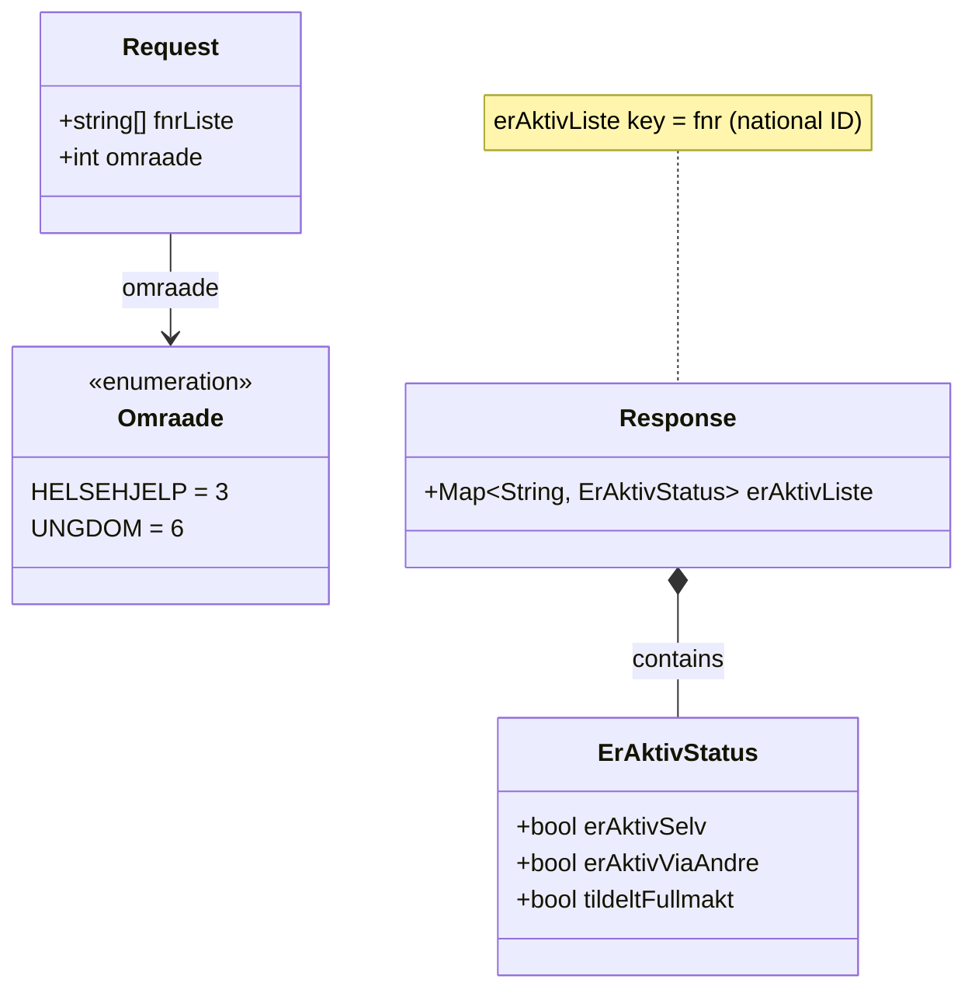

# Relations

Mermaid diagrams showing class relationships for HelsenorgeAktivSjekken.

- [ClassRelations.mmd](ClassRelations.mmd) – Request/response and status linkage

```mermaid
classDiagram
	class Request {
		+string[] fnrListe
		+int omraade
	}

	class Omraade {
		<<enumeration>>
		HELSEHJELP = 3
		UNGDOM = 6
	}

	class Response {
		+Map~String, ErAktivStatus~ erAktivListe
	}

	note for Response "erAktivListe key = fnr (national ID)"

	class ErAktivStatus {
		+bool erAktivSelv
		+bool erAktivViaAndre
		+bool tildeltFullmakt
	}

	Request --> Omraade : omraade
	Response *-- ErAktivStatus : contains

```
