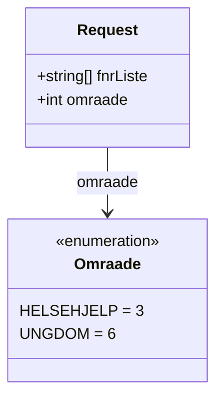
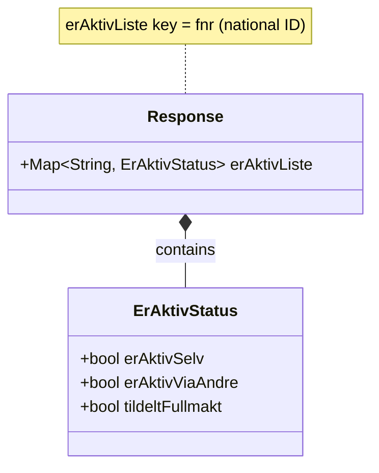

# Relations

Mermaid diagrams showing class relationships for HelsenorgeAktivSjekken.

- [RequestRelations.mmd](RequestRelations.mmd) – Request to context area mapping

- [ResponseRelations.mmd](ResponseRelations.mmd) – Response status composition

